# Communication Research Skills for Codex

A maintainable Codex Skill suite for communication research and computational communication studies (计算传播学). It differs from general CS or social-science packages by routing research through a communication reasoning graph — phenomenon, literature, theory, construct, mechanism, RQ/H, operationalization, measurement, design, evidence, and theoretical contribution — and by enforcing seven domain gates.

## What is inside

Eighteen installable Skills live under `skills/`, one directory per Skill:

| Skill | Role |
|---|---|
| `communication-research-workflow` | Orchestrator: controller/executor/auditor roles, task contracts, window plans, gates, routing |
| `communication-literature` | Communication/media literature search, screening, evidence matrices |
| `communication-theory` | Theory-mechanism fit and rival-explanation audit |
| `communication-construct` | Construct existence checks, disambiguation, definition lock |
| `communication-scale` | Validated scales, adaptation, CFA, measurement invariance |
| `communication-method-router` | Goal-first method selection before any algorithm or design |
| `communication-experiment` | Survey/online/HMC/AI-disclosure experiment design |
| `communication-content-analysis` | Corpus, codebooks, LLM/human coding, reliability, validation |
| `communication-network-analysis` | Graph contracts, communities, diffusion, ERGM, SAOM, relational events |
| `communication-causal-inference` | Estimands, DAGs, natural/quasi-experiments, diagnostics, sensitivity |
| `communication-temporal-analysis` | Time series, panels, event history, survival, sequence analysis |
| `communication-multimodal-analysis` | Image, video, audio, OCR/ASR, computer vision, multimodal validation |
| `communication-spatial-analysis` | GIS, geocoding, spatial dependence, geographic diffusion, map integrity |
| `communication-simulation` | ABM, opinion dynamics, generative/LLM-agent calibration and validation |
| `communication-writing` | Evidence-bound communication/social-science drafting, revision, synchronization, rebuttal, and finalization |
| `communication-prose-revision` | Reduce formulaic and defensive prose without changing scientific meaning or optimizing for detectors |
| `communication-reviewer` | Seven-gate review and audit output |
| `scholarly-access` | Legal five-layer full-text resolution and archiving |

## Research flow

```mermaid
flowchart LR
    P["Phenomenon"] --> L["Literature"]
    L --> T["Theory"]
    T --> C["Construct"]
    C --> M["Mechanism"]
    M --> R["RQ / Hypotheses"]
    R --> O["Operationalization"]
    O --> S["Measurement"]
    S --> D["Design / Identification"]
    D --> E["Evidence"]
    E --> G["Theoretical contribution"]
```



Seven gates sit on this graph: Theory, Construct, Measurement, Design/Identification, Novelty, Contribution, and Evidence-to-Claim. Each is owned by a specialist Skill and enforced by the orchestrator before the next transition.

## Installation

Copy the whole suite into your Codex skills directory:

```bash
scripts/install.sh                 # installs to ~/.codex/skills
scripts/install.sh --dest /tmp/x   # install to a test destination
scripts/uninstall.sh               # removes the eighteen installed folders
```

Manual installation is equivalent: copy each folder in `skills/` into `~/.codex/skills/<folder-name>/`. After installation, refresh or restart Codex so the new Skills appear in the catalog.

The orchestrator lives at `skills/communication-research-workflow/` and the domain Skills in sibling folders under `skills/`.

## Quick start

Invoke the orchestrator with a realistic research request:

```text
$communication-research-workflow

Plan only. Topic: compare how responsibility for an environmental risk is framed
across two digital platforms over time. Classify the research goal before choosing a
method, propose the lifecycle, route the specialist Skills, and list the evidence and
measurement gates that must pass before analysis.
```

For a narrow capability, invoke the domain Skill directly, for example
`$communication-theory`, `$communication-content-analysis`,
`$communication-network-analysis`, `$communication-causal-inference`, or
`$communication-writing`; use `$scholarly-access` with a DOI list.

## Project-control layer

Long-running projects can be governed without moving existing files. The orchestrator creates
the same non-invasive `.codex-research/` layer used by its upstream:

```text
research-project/
├── existing data, code, manuscripts, and outputs
└── .codex-research/
    ├── project.yaml
    ├── state.yaml
    ├── windows.yaml
    ├── decisions.md
    ├── contracts/
    ├── handoffs/
    ├── audits/
    └── snapshots/
```

Only the controller writes authoritative governance state. Executors and auditors return
immutable handoffs with hashes and fresh verification.

## Personalization and case study

The generic Skills never embed personal research defaults. Private or project-specific
preferences belong in a personal derivative or project `AGENTS.md`, following
`references/personalization-guide.md`. A full worked case study of the role and handoff
lifecycle is in `references/complete-case-study.md`.

## Unified methodology, CSS layer, and demo

- `METHODOLOGY.md` is the single methodology the suite operationalizes: the reasoning
  graph, the seven gates, goal-first method routing, evidence-to-claim discipline, the
  five-layer scholarly-access policy, and the end-to-end workflow.
- Computational social science sits under the communication layer. The general CSS theory
  anchors are in `skills/communication-theory/references/css-theory.md`, and the general
  CSS method families are in `skills/communication-method-router/references/css-methods.md`.
- `demo/RESEARCH_DEMO.md` contains three synthetic, replaceable examples covering
  computational content analysis, network/diffusion analysis, and communication
  experiments. The generated plans demonstrate archetype-level window graphs without
  encoding a preferred topic or project. Network, causal, temporal, multimodal,
  spatial, and simulation analyses each have a dedicated specialist Skill.

## License

MIT. See `LICENSE` and `NOTICE.md` for upstream attribution and methodological inspiration.
