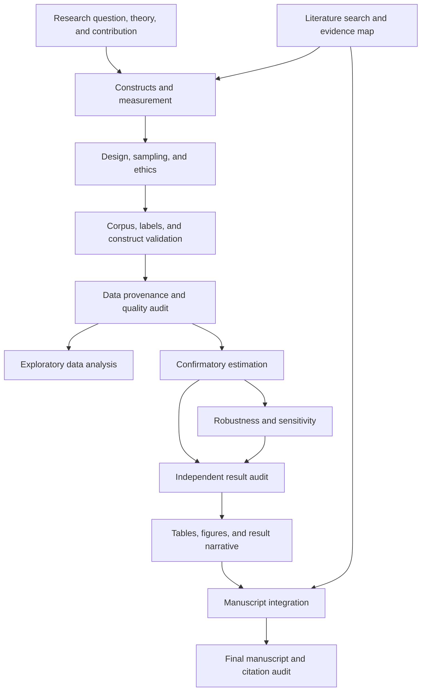

# Research window plan: Generic computational content analysis lifecycle

- Project ID: `demo-generic-text-computational`
- Archetype: `text-computational`
- Status: `proposed-not-authoritative`

## Windows

| Window | Role | Timing | Lifecycle | Work package |
|---|---|---|---|---|
| C0 | controller | Open now | long-lived | governance |
| W01 | executor | Open now | stage-bound | question-theory |
| W02 | executor | Open now | stage-bound | literature-evidence |
| W03 | executor | Open later | stage-bound | constructs-measurement |
| W04 | executor | Open later | stage-bound | design-sampling-ethics |
| W05 | executor | Open later | stage-bound | annotation-validation |
| W06 | executor | Open later | stage-bound | data-audit |
| W07 | executor | Open later | stage-bound | exploratory-analysis |
| W08 | executor | Open later | stage-bound | confirmatory-model |
| W09 | executor | Open later | stage-bound | robustness-sensitivity |
| W10 | auditor | Open later | stage-bound | audit-results |
| W11 | executor | Open later | stage-bound | results-integration |
| W12 | executor | Open later | stage-bound | manuscript-integration |
| W13 | auditor | Open later | stage-bound | audit-final |

## Dependency graph

## Work packages

### question-theory: Research question, theory, and contribution

- Role: `executor`; rigor: `standard`; timing: **Open now**
- Depends on: none
- Goal: Turn the topic into answerable questions, mechanisms, rival explanations, and contribution claims.
- Deliverables: research-question memo; mechanism map; rival explanations; feasibility risks
- Open when: Project boundary is recorded
- Close when: Deliverables, fresh verification, and an immutable handoff are accepted

### literature-evidence: Literature search and evidence map

- Role: `executor`; rigor: `standard`; timing: **Open now**
- Depends on: none
- Goal: Establish the verified evidence base, disagreements, boundary conditions, and unresolved gaps.
- Deliverables: search log; screening rules; evidence matrix; claim-support status
- Open when: Project boundary is recorded
- Close when: Deliverables, fresh verification, and an immutable handoff are accepted

### constructs-measurement: Constructs and measurement

- Role: `executor`; rigor: `standard`; timing: **Open later**
- Depends on: `question-theory`, `literature-evidence`
- Goal: Map every theoretical construct to observations and assess validity, reliability, and proxy limits.
- Deliverables: construct dictionary; operational definitions; validity threats
- Open when: All dependencies are accepted by the controller
- Close when: Deliverables, fresh verification, and an immutable handoff are accepted

### design-sampling-ethics: Design, sampling, and ethics

- Role: `executor`; rigor: `standard`; timing: **Open later**
- Depends on: `constructs-measurement`
- Goal: Specify population, sample, timing, comparison, ethics, privacy, estimand, and analysis boundaries.
- Deliverables: design protocol; sampling plan; ethics and data-governance checklist; definition lock candidate
- Open when: All dependencies are accepted by the controller
- Close when: Deliverables, fresh verification, and an immutable handoff are accepted

### annotation-validation: Corpus, labels, and construct validation

- Role: `executor`; rigor: `audit`; timing: **Open later**
- Depends on: `design-sampling-ethics`
- Goal: Lock corpus boundaries, annotation protocol, intercoder checks, leakage controls, and construct-validity tests.
- Deliverables: corpus contract; annotation guide; validation plan
- Open when: All dependencies are accepted by the controller
- Close when: Deliverables, fresh verification, and an immutable handoff are accepted

### data-audit: Data provenance and quality audit

- Role: `executor`; rigor: `standard`; timing: **Open later**
- Depends on: `annotation-validation`
- Goal: Verify sources, units, keys, joins, missingness, exclusions, versions, and row transitions.
- Deliverables: data contract; schema and key audit; sample-flow table; variable dictionary
- Open when: All dependencies are accepted by the controller
- Close when: Deliverables, fresh verification, and an immutable handoff are accepted

### exploratory-analysis: Exploratory data analysis

- Role: `executor`; rigor: `quick`; timing: **Open later**
- Depends on: `data-audit`
- Goal: Describe data quality and patterns without converting exploration into confirmatory evidence.
- Deliverables: EDA report; anomaly log; descriptive tables
- Open when: All dependencies are accepted by the controller
- Close when: Deliverables, fresh verification, and an immutable handoff are accepted

### confirmatory-model: Confirmatory estimation

- Role: `executor`; rigor: `audit`; timing: **Open later**
- Depends on: `data-audit`
- Goal: Estimate the locked estimand using the prespecified primary specification and diagnostics.
- Deliverables: model outputs; effect sizes and uncertainty; diagnostics; run log
- Open when: All dependencies are accepted by the controller
- Close when: Deliverables, fresh verification, and an immutable handoff are accepted

### robustness-sensitivity: Robustness and sensitivity

- Role: `executor`; rigor: `audit`; timing: **Open later**
- Depends on: `confirmatory-model`
- Goal: Test plausible alternative specifications and threats without selecting results by significance.
- Deliverables: robustness matrix; sensitivity results; scope-of-claim recommendation
- Open when: All dependencies are accepted by the controller
- Close when: Deliverables, fresh verification, and an immutable handoff are accepted

### audit-results: Independent result audit

- Role: `auditor`; rigor: `audit`; timing: **Open later**
- Depends on: `confirmatory-model`, `robustness-sensitivity`
- Goal: Independently verify sample, estimand, code, diagnostics, tables, and claim strength.
- Deliverables: Critical/Major/Minor audit report; verdict; verified artifact hashes
- Open when: All dependencies are accepted by the controller
- Close when: Deliverables, fresh verification, and an immutable handoff are accepted

### results-integration: Tables, figures, and result narrative

- Role: `executor`; rigor: `standard`; timing: **Open later**
- Depends on: `audit-results`
- Goal: Create a consistent data-to-table-to-figure-to-text result chain.
- Deliverables: final tables; reproducible figures; result narrative; lineage check
- Open when: All dependencies are accepted by the controller
- Close when: Deliverables, fresh verification, and an immutable handoff are accepted

### manuscript-integration: Manuscript integration

- Role: `executor`; rigor: `standard`; timing: **Open later**
- Depends on: `results-integration`, `literature-evidence`
- Goal: Integrate the question, evidence, design, results, limitations, and contribution for the target audience.
- Deliverables: claim map; manuscript draft; number and terminology inventory
- Open when: All dependencies are accepted by the controller
- Close when: Deliverables, fresh verification, and an immutable handoff are accepted

### audit-final: Final manuscript and citation audit

- Role: `auditor`; rigor: `audit`; timing: **Open later**
- Depends on: `manuscript-integration`
- Goal: Verify claim-source support, numerical consistency, reporting requirements, and completion evidence.
- Deliverables: final audit report; citation-support matrix; submission readiness verdict
- Open when: All dependencies are accepted by the controller
- Close when: Deliverables, fresh verification, and an immutable handoff are accepted

## Controller decision points

- primary research question or theoretical contribution changes
- construct, source-of-truth, sample, key, or time window changes
- estimand or identification strategy changes
- external write or final submission is proposed
