# Communication Research Workflow

## Overview

This is a reusable research orchestrator for communication and computational communication studies. It converts a consequential research request into a bounded task contract, routes to the smallest sufficient stack of communication specialist Skills, and keeps theory, constructs, measurement, evidence, data, analysis, writing, and delivery consistent.

Users invoke the orchestrator with `$communication-research-workflow` followed by the research request, or route directly to a narrower Skill when only one stage is needed.

It is a derivative of `codex-research-workflow` (MIT): the controller/executor/auditor model, `.codex-research/` project-control layer, task-contract schema, handoff protocol, prompt workbench, and six hard gates are preserved. What changed is the research reasoning graph: communication research reasons from phenomenon to theory, construct, mechanism, RQ/H, operationalization, measurement, design, evidence, and theoretical contribution rather than from a method or a codebase.

This Skill does not replace domain Skills. It governs how they are selected and how their outputs are checked.

## Scope filter

Use this Skill for consequential communication research work:

- survey, experiment, or field research on audiences, journalism, platforms, or human-machine interaction;
- computational content analysis, text or multimodal media, platform traces,
  network, temporal, spatial, causal, or simulation analysis that answers a
  communication question;
- literature review, theory/construct/measurement development, manuscript writing or review for communication venues;
- continuation of a governed research project with multiple windows or contributors.

Do not trigger it for:

- reading or summarizing one PDF;
- routine, non-research code questions;
- teaching or administrative tasks with no research judgment;
- a one-step formatting request.

If explicitly invoked for an out-of-scope task, explain the mismatch briefly and use the narrower Skill.

## Required start

1. Read [references/profile-and-preferences.md](references/profile-and-preferences.md).
2. Classify the request with [references/communication-router.md](references/communication-router.md): identify the phenomenon, the target research goal (description, measurement, explanation, prediction, causal identification, or simulation explanation), and the closest registered archetype.
3. Build the task contract with [references/task-contract-and-router.md](references/task-contract-and-router.md).
4. Read only the workflow reference relevant to the selected route:
   - question, literature, theory/construct/scale, or continuation: [references/research-workflows.md](references/research-workflows.md) plus [references/communication-ontology.md](references/communication-ontology.md);
   - data, empirical analysis, code, or figures: [references/empirical-workflows.md](references/empirical-workflows.md);
   - survey/experiment/HMC, qualitative, or mixed-methods: [references/social-science-workflows.md](references/social-science-workflows.md), plus the applicable strand-specific reference;
   - writing, revision, review, journal fit, or finalization: [references/writing-review-workflows.md](references/writing-review-workflows.md).
5. Read [references/skill-registry.md](references/skill-registry.md) before selecting supporting Skills. Use only Skills available in the current session; never invent a Skill or install one silently.
6. Apply [references/integrity-and-delivery-gates.md](references/integrity-and-delivery-gates.md) throughout, not only at the end.
7. For project initialization, multiple task instances, handoffs, state merges, or research freezes, read [references/project-coordination.md](references/project-coordination.md).
8. For controller-created lifecycle, window, or work-package plans, read [references/controller-planning.md](references/controller-planning.md).
9. When the user asks to write or improve a research prompt, or `target_role=prompt`, read [references/prompt-compilation.md](references/prompt-compilation.md). Generate the prompt only; do not execute the compiled task.
10. Read [references/personalization-guide.md](references/personalization-guide.md) only when creating a private derivative or project-specific adaptation. Read [references/complete-case-study.md](references/complete-case-study.md) for onboarding or when the role/handoff lifecycle needs a concrete example.

Read [references/examples.md](references/examples.md) when the task contract or boundary is ambiguous.

### Reference map

All reference files live directly under `references/` and are read only when the listed need applies:

- `communication-ontology.md` — the communication reasoning graph and typical research objects;
- `communication-router.md` — goal-first routing to archetypes and specialist Skills;
- `task-contract-and-router.md` — contract fields, task types, authority precedence, pause protocol;
- `research-workflows.md` — question, literature, theory/construct/scale, and continuation routes;
- `empirical-workflows.md` — data, analysis, code, and figure routes;
- `social-science-workflows.md` — survey/experiment/HMC, qualitative, and mixed-methods routes;
- `writing-review-workflows.md` — drafting, review, journal-fit, and citation routes;
- `integrity-and-delivery-gates.md` — the hard gates shared by every route;
- `skill-registry.md` — preferred specialist routes and fallback rules;
- `controller-planning.md` — window planning and rolling work-package plans;
- `project-coordination.md` — `.codex-research/` governance, handoffs, state merges, freezes;
- `prompt-compilation.md` — compiled-prompt mode and its ownership boundary;
- `personalization-guide.md` — private derivatives versus the generic Skill;
- `profile-and-preferences.md` — how to read researcher defaults without overfitting;
- `examples.md` — example contracts and routing cases;
- `complete-case-study.md` — full role/handoff lifecycle walkthrough.

## Communication reasoning graph

Before choosing a method, locate the request on this graph and record where work starts and where it must stop:

```mermaid
flowchart LR
    P["Phenomenon"] --> L["Literature"]
    L --> T["Theory"]
    T --> C["Construct"]
    C --> M["Mechanism"]
    M --> R["RQ / Hypotheses"]
    R --> O["Operationalization"]
    O --> S["Measurement"]
    S --> D["Design / Identification"]
    D --> E["Evidence"]
    E --> G["Theoretical contribution"]
```



Each transition is gated. A study does not move from theory to construct unless the theory names a mechanism and its boundary conditions; from construct to measurement unless the construct exists, is disambiguated, and has a valid operationalization; from evidence to contribution unless the numbers support the claim and rival explanations were checked.

## Seven domain gates

The orchestrator enforces seven gates. Every gate is applied by reading the relevant specialist Skill; the orchestrator never lowers a gate when a specialist is missing, it routes to the closest available Skill or marks the work `needs-specialist`:

1. **Theory Gate** — does the theory explain the mechanism, not merely share keywords with the topic?
2. **Construct Gate** — does the construct already exist under this or another name; is the definition stable across sections?
3. **Measurement Gate** — is the construct operationalized with a validated scale or audited measure; does cross-cultural adaptation hold?
4. **Design / Identification Gate** — does the design, sample, and comparison support the intended inference?
5. **Novelty Gate** — what is new relative to the field, not merely the setting or dataset?
6. **Contribution Gate** — what does the result change about communication theory or accumulated evidence?
7. **Evidence-to-Claim Gate** — do the reported numbers, reliability, and diagnostics support every stated claim?

## Task contract

Establish these fields before material action:

```yaml
schema_version: codex-research-contract/v1  # project mode only
project_id: stable project ID               # project mode only
task_id: unique work-package ID             # project mode only
target_role: controller | prompt | executor | auditor
state_revision: state revision read by this contract
contract_version: positive revision number
task_type: one registered research task type
goal: concrete outcome for this run
operation: diagnose | plan | execute | review | full-pipeline
rigor: quick | standard | audit
authority: read-only | edit-existing | create-new
source_of_truth: authoritative files, datasets, fields, samples, versions
materials: allowed inputs
input_artifacts: required project artifacts
deliverables: requested answers or artifacts
quality_gates: checks that must pass
constraints: length, venue, method, time, and format limits
stop_conditions: changes that require confirmation
uncertainties: facts not yet verified
return_handoff: true | false
```

Do not force the user to complete a form. Infer safe fields from the request and read-only inspection; surface only choices that materially change the work. Validate a saved JSON/YAML contract with:

```bash
python scripts/validate_task_contract.py <contract.json-or-yaml>
```

## Authority rules

- `operation=review` and `operation=diagnose` may not modify the object under review. They are otherwise read-only, except an auditor contract may write a new report only under `.codex-research/audits/` and a new immutable handoff under `.codex-research/handoffs/`; this reporting sink never authorizes edits to research artifacts or governance state.
- `operation=plan` describes future work; treat it as read-only unless the user explicitly changes the operation to `execute`.
- Enter `execute` or `full-pipeline` only when the user has requested implementation.
- When clauses conflict, use the narrower authority. Deadline, convenience, or “顺手” language never expands authority.
- Read only materials needed for the goal. A path is not permission to inspect every file below it.
- External writes, submissions, messages, database mutations, or library changes require explicit authority for that destination.
- Scholarly access never stores or reads plaintext passwords; use only the user's own authenticated session and follow the access policy in the `scholarly-access` Skill.

## Routing and execution

1. Confirm the project, authoritative materials, data version, analysis unit, time window, keys, sample, estimand or construct, and requested deliverable to the degree relevant.
2. Route with [references/communication-router.md](references/communication-router.md) and select the smallest sufficient Skill stack from [references/skill-registry.md](references/skill-registry.md). Follow every selected Skill's instructions; this orchestrator does not override them.
3. Label substantive claims as `evidence`, `inference`, `hypothesis`, `recommendation`, or `unverified` when their status could be confused.
4. Execute only within the task contract. Re-check authority before every write and re-check source-of-truth before every analysis or manuscript claim.
5. Run route-specific checks and all applicable gates.
6. Verify the actual deliverables with fresh evidence before claiming completion.

## Six hard gates

1. **Authority:** action matches operation and authority.
2. **Materials:** source, version, fields, keys, sample, and exclusions are recorded or explicitly unresolved.
3. **Epistemic status:** evidence, inference, hypothesis, recommendation, and unverified facts are not conflated.
4. **Empirical truthfulness:** never alter data, samples, models, or figures to obtain an expected direction, statistical significance, or a preferred visual appearance. Figures and prose must derive from the same verified results.
5. **Citation support:** verify both that a source exists and that it supports the exact claim. Do not let a "real paper" mask an unsupported sentence.
6. **Completion:** claim completion only after running fresh validation, reading its result, and checking every requested deliverable.

## Project coordination

`project-governance` covers project initialization, restoration, multi-instance work-package routing, handoff validation, state merging, and research or submission freezes.

The collaboration model has four role types, not exactly four tasks: one controller, zero or more prompt workbenches, multiple executor work packages, and multiple independent auditors. The controller is the only writer of authoritative governance state. Executors and auditors write separate immutable handoffs; they never update `state.yaml`, contracts, or the decision log.

The controller must propose the research lifecycle and window plan before opening substantial work packages. Classify windows as `Open now`, `Open later`, or `Not currently needed`; specify dependencies, inputs, write scopes, deliverables, specialist Skills, rigor, audit requirements, and close conditions. Keep only one controller and normally only three to five active windows. Treat the first plan as a rolling proposal, not immutable research truth.

Initialize and validate the minimal control layer with:

```bash
python scripts/init_research_project.py <project-root> --project-id <id> [--title <title>] [--dry-run]
python scripts/validate_project_control.py <project-root>
```

Generate a reviewable social-science project scaffold without opening tasks or changing project state:

```bash
python scripts/plan_research_project.py --project-id <id> --archetype <archetype> --format markdown
```

Create and validate handoffs with `create_handoff.py` and `validate_handoff.py`. Do not automatically start subagents or separate Codex tasks. Work inline by default; use parallel or independent agents only when the user explicitly asks, a selected Skill requires it, or the work is an isolated evaluation of this Skill.

## Mandatory pause points

Pause and request the smallest necessary decision when:

- authority remains unclear after applying the narrower interpretation;
- the authoritative source, core construct/field, key, sample, or exclusion rule changes;
- the estimand, identification strategy, or primary research question changes;
- an external system is about to be written to;
- a final submission version is about to be created or submitted.

State what is known, what changed, why it matters, and the exact choice required. Continue safe independent work when possible.

## Personalization boundary

Keep the distributed Skill generic. Put stable private researcher defaults only in a separately named local derivative, and project-specific paths, definitions, permissions, and venues in project `AGENTS.md` and contracts. Never package full papers, raw chats, credentials, protected data, or unpublished corpora. Use the template under `assets/personalization/` and run privacy checks before publishing.

## Final response

Lead with the outcome. Report:

- what was answered or changed;
- authoritative inputs and important boundaries;
- verification actually run and its result;
- unresolved uncertainty or required decision;
- paths to created or edited artifacts, when any.

Do not repeat basic Codex usage guidance unless requested. Follow the user's language and communicate at the level of an experienced communication researcher.
