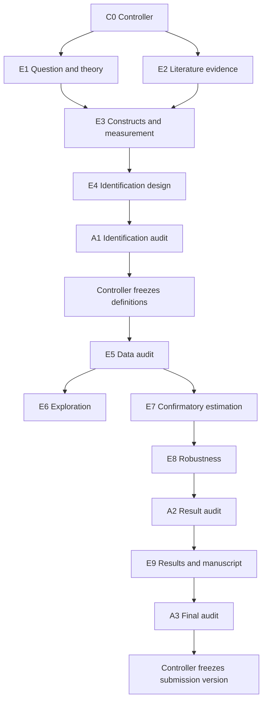

# Complete onboarding case: evaluating a municipal transparency reform

## Contents

1. Research request
2. Controller plan
3. Window sequence
4. Contracts and handoffs
5. Definition change
6. Writing and final audit
7. Copyable prompts

## 1. Research request

Assume a researcher asks:

> Did municipal transparency-portal adoption improve administrative responsiveness? I have annual city-level data, portal adoption dates, and complaint-resolution times. Help me design and carry out a rigorous study, but do not assume the policy caused the outcome.

The controller classifies the primary archetype as `causal-policy-evaluation`, with a panel-data branch. It records unresolved questions before analysis:

- Is adoption one-time, reversible, or phased?
- What is the target estimand: effect on treated cities, all eligible cities, or another contrast?
- Are complaint definitions and reporting systems stable across cities and years?
- Are adoption timing, anticipation, spillovers, and concurrent reforms observable?
- Which cities and years form the eligible risk set?

## 2. Controller plan

The controller proposes, but does not automatically open, these windows:

| Window | Timing | Task | Why separate |
|---|---|---|---|
| C0 Controller | Open now, long-lived | state, contracts, decisions, freezes | single authoritative state writer |
| P0 Prompt workbench | Optional | compile role prompts | no research execution |
| E1 Question and theory | Open now | mechanism, rivals, contribution | protects theory from data-driven drift |
| E2 Literature evidence | Open now | policy-transparency evidence matrix | independent evidence provenance |
| E3 Constructs and measurement | Open later | responsiveness and adoption definitions | construct-validity gate |
| E4 Identification design | Open later | estimand, timing, counterfactual, assumptions | must precede modeling |
| A1 Identification audit | Open later | challenge design independently | prevents executor self-approval |
| E5 Data audit | Open later | panel keys, missingness, dates, sample flow | authoritative empirical source |
| E6 Exploratory analysis | Open later | trends and anomalies | explicitly exploratory |
| E7 Confirmatory estimation | Open later | accepted primary model | uses frozen definitions |
| E8 Robustness | Open later | alternative assumptions and sensitivity | no significance shopping |
| A2 Result audit | Open later | sample-model-table verification | completion gate |
| E9 Results and manuscript | Open later | figures, prose, limitations | grounded in accepted results |
| A3 Final audit | Open later | citations, numbers, venue requirements | submission gate |

The controller opens only E1 and E2 first. It keeps all later windows dormant.

## 3. Window sequence



## 4. Contracts and handoffs

An abbreviated identification contract:

```yaml
schema_version: codex-research-contract/v1
project_id: municipal-transparency
task_id: design-identification
target_role: executor
state_revision: 4
contract_version: 1
task_type: empirical-analysis
goal: define a defensible estimand and identification plan before estimation
operation: plan
rigor: audit
authority: read-only
source_of_truth:
  design_memo: project/design/questions.md
  panel_unit: municipality-year
  treatment: first verified full portal adoption
  outcome: median complaint-resolution days
  estimand: to-be-decided
materials:
  - verified literature matrix
  - adoption metadata documentation
  - outcome data dictionary
deliverables:
  - identification memo
  - assumption-to-diagnostic matrix
  - explicit decisions needed from researcher
quality_gates:
  - construct validity
  - treatment timing
  - comparison group
  - causal-language scope
constraints:
  - do not estimate models
  - do not edit source data
stop_conditions:
  - adoption or outcome definition changes
  - target estimand requires researcher choice
uncertainties:
  - anticipation and concurrent reforms not yet verified
return_handoff: true
```

The executor returns an immutable handoff containing the memo path, file hash, verification, unresolved choices, and recommended next action. It does not update `state.yaml`.

The auditor then reviews the exact contract and memo. A `Major` finding about unstable outcome definitions blocks the design from being frozen.

## 5. Definition change

Suppose the data audit shows that some cities count unresolved complaints at year end while others count complaints opened during the year. This changes the outcome construct.

Correct response:

1. stop confirmatory estimation;
2. return `needs-decision` to the controller;
3. freeze the old definition and record the evidence;
4. decide whether to harmonize, restrict, stratify, or change the question;
5. issue a new contract version;
6. invalidate dependent exploratory or model outputs;
7. rerun every downstream table, figure, claim, and audit.

Incorrect response: choose the definition that produces the expected policy effect or silently retain old figures.

## 6. Writing and final audit

After result audit passes, the writing window builds a claim map:

```text
research question
→ theory and mechanism
→ identification assumptions
→ accepted estimate and uncertainty
→ robustness and remaining threats
→ bounded interpretation
→ practical implication
```

The manuscript must distinguish observed association, design-dependent causal interpretation, and recommendation. The final auditor checks every number against accepted outputs and verifies each material citation for both identity and claim support.

The controller creates the final submission freeze only after the researcher approves the target version.

## 7. Copyable prompts

### Start the controller

```text
Use $communication-research-workflow.

Act as the sole controller for a project studying municipal transparency-portal adoption
and administrative responsiveness. Plan only. Classify the study design, list unresolved
construct and identification decisions, propose a dependency graph, and classify windows
as Open now, Open later, or Not currently needed. Issue contracts only for the first one
to three ready windows. Do not estimate models or create other Codex tasks automatically.
```

### Start an executor

```text
Use $communication-research-workflow.

Act as the executor for the assigned work package. Read only the project-control files and
materials named in the contract. Verify state_revision before writing. Do not modify state,
contracts, or decisions. Return artifact paths, hashes, fresh verification, uncertainties,
decisions needed, and an immutable handoff.
```

### Start an auditor

```text
Use $communication-research-workflow.

Act as an independent auditor. Review the exact contract, target artifacts, and evidence.
Do not edit the audited object or authoritative project state. Report Critical, Major, and
Minor findings with location, evidence, consequence, recommendation, and a pass/block verdict.
```
